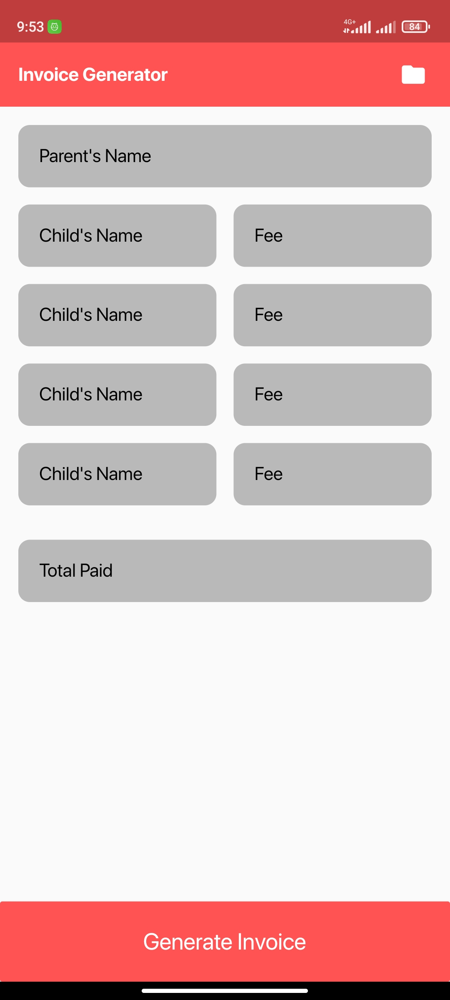
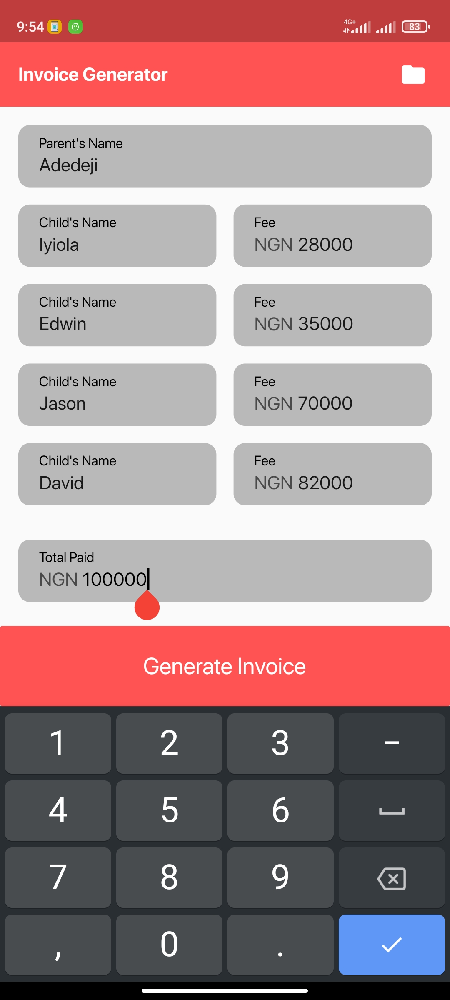
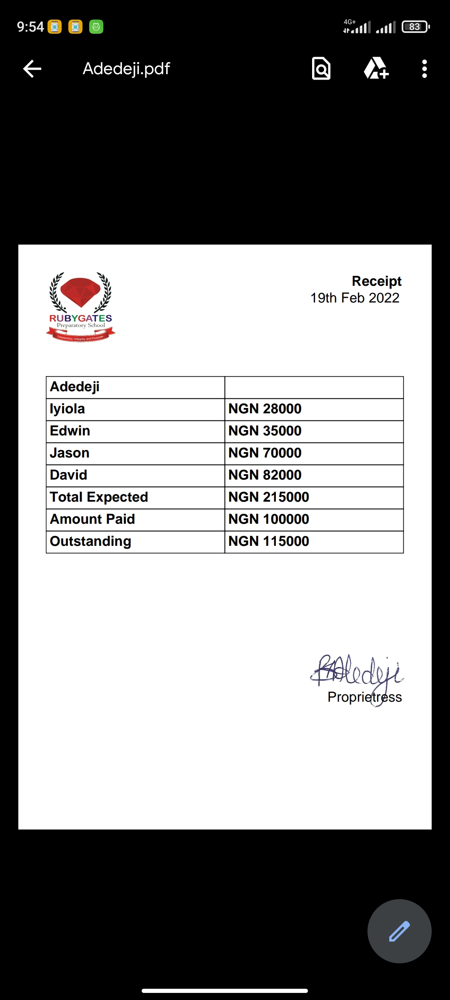
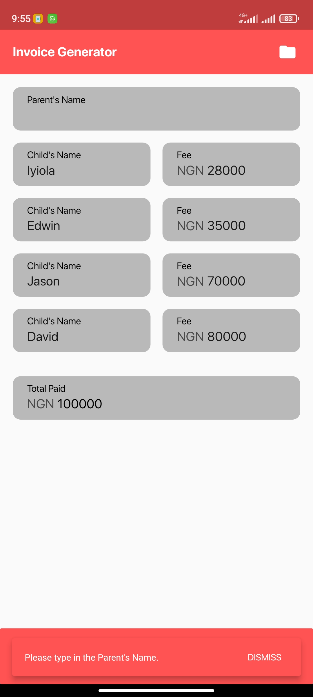
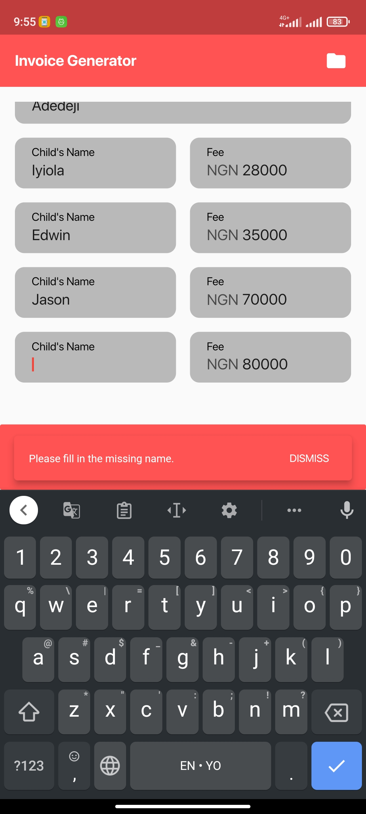
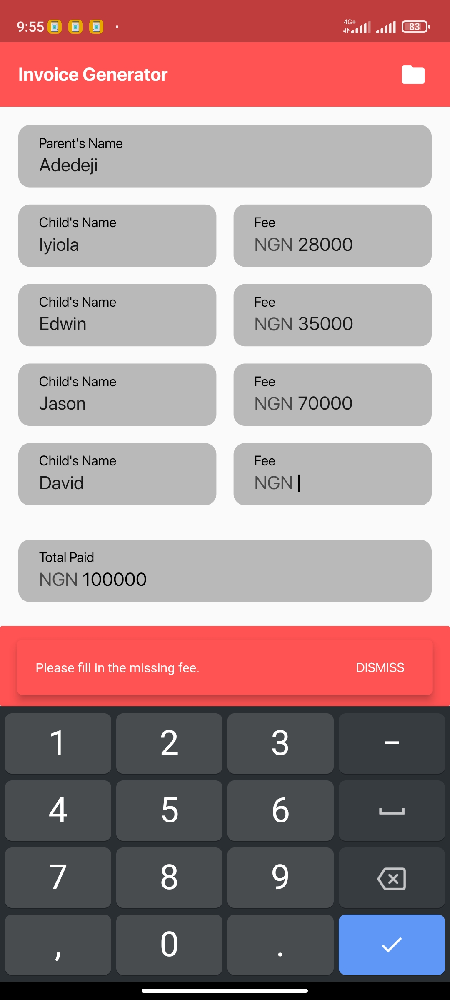

# Invoice Generator (Flutter)

A mobile application, made with Flutter, for generating invoices for
businesses (schools in particular). The application is currently
hardcoded, but efforts are being made to make it customizable for use
by any business or school. Features that will be added will include
adding your business logo, signature and a file manager of sorts to
be able to view all generated receipts.

## Overview and Screenshots

The interface for the application is very simple, containing only
textboxes to accept parent's name and children's names and their
corresponding fees to be paid. In future updates, the text field
labels will be customizable for different business types.

The generated PDF is a basic, single page receipt containing the
the parent's name, child's name and fees, total fees paid, total
fees, expected and outstanding fees. It also contains a signature.
The filename of the generated PDF is also the parent's name.

## Other Screenshots

